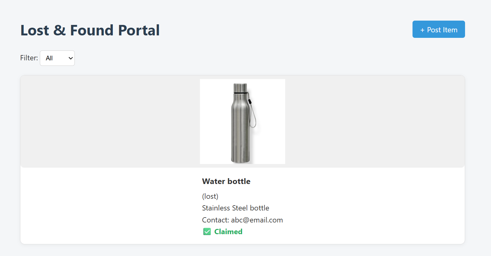
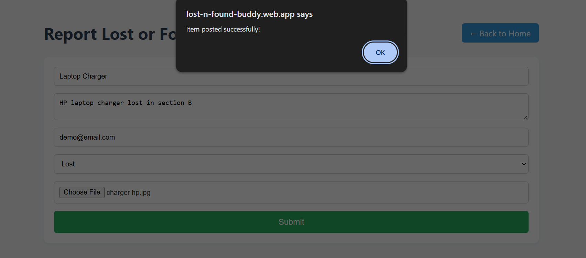
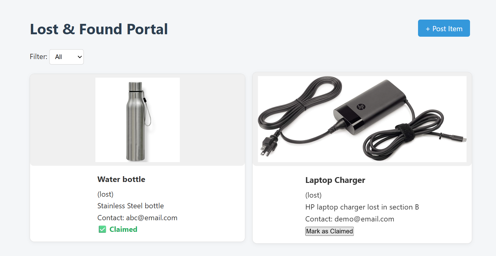

# Lost & Found Portal 🎒

A simple, responsive **Lost & Found portal** for university campuses, built with **HTML, CSS, JavaScript**, and powered by **Firebase** (Firestore, Storage, Hosting).

🚀 [Live Demo] https://lost-n-found-buddy.web.app

---

## ✨ Features

✅ Post lost or found items with image, description, and contact details  
✅ View all posts categorized by type (Lost / Found)  
✅ Mark items as **Claimed** when recovered  
✅ Responsive UI for mobile & desktop  
✅ Data stored in **Firebase Firestore**  
✅ Images uploaded to **Firebase Storage**  
✅ Deployed on **Firebase Hosting**

---

## 📸 Screenshots

| Home Page                       | Add New Item                       | Item Claimed                     |
|---------------------------------|------------------------------------|----------------------------------|
|    |         |   |

---

## 🚀 Tech Stack

- **Frontend:** HTML, CSS, JavaScript
- **Backend:** Firebase Firestore, Firebase Storage
- **Hosting:** Firebase Hosting

---

## ⚙️ Setup & Deployment

### 🔥 Prerequisites
- Node.js & npm
- Firebase CLI
- A Firebase project with Firestore & Storage enabled

---

### 🚀 Clone this repo
```bash
git clone https://github.com/Anjalivibrant/lost-found-portal
cd lost-found-portal
